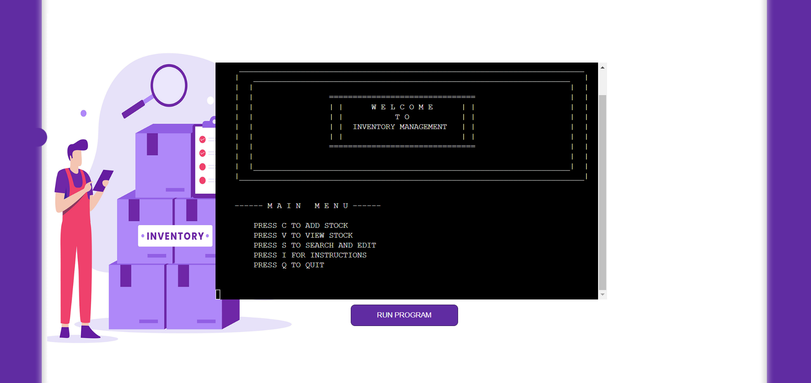

# Inventory Management
[Link to deployed project](https://pp3-inventory-management-app.herokuapp.com/)
---

Inventory Management is a software program developed to facilitate the management of serialized inventory for businesses. This application is specifically tailored for businesses that utilize stock with unique serial numbers. The implemented features allow the user to efficiently add, search, view, change location, and delete stock from the system. These capabilities prove particularly valuable to businesses that install equipment in various locations and rely on engineering services to do so, as the program enables them to keep track of the precise location of each item.

# Table Of Content

-   [User Experience](#user-experience)
    -   [User Stories](#user-stories)
    -   [Goals](#goals)
    -   [Scope](#scope)
-   [Design](#design)
    -   [Colour Scheme](#colour-scheme)
    -   [Flowcharts](#flowcharts)
-   [Features](#features)
    -   [Welcome Screen](#Welcome-Screen)
-   [Future Features](#future-features)
-   [Testing](#testing)
-   [Bugs](#Bugs)
-   [Technologies And Languages](#technologies-and-languages)
-   [Deployment](#deployment)
    -   [Creating A Fork](#creating-a-fork)
    -   [Cloning Repository](#cloning-repository)
-   [Credits](#credits)
    -   [Media](#media)
    -   [Code](#code)
    -   [Acknowledgements](#acknowledgements)
    -   [Comments](#comments)

---

# User Experience

## User Stories

1. As a warehouse manager, I want to easily add new items to the inventory system, so that I can keep track of all the items that we have in stock.
2. As a warehouse manager, I want to be able to search for specific items in the inventory system, so that I can quickly locate items when I need them.
3. As an engineer, I want to be able to update the location of items in the inventory system, so that I can keep track of the location of items that I need to use in the field.
4. As an inventory manager, I want to be able to delete items from the inventory system, so that I can remove items that are no longer in use or have been added incorrectly
5. As a warehouse manager, I want to be able to view all stock in the inventory system, so that I can have a comprehensive overview of all items in stock.
6. As an inventory manager, I want to be able to ensure that duplicate items are not added to the inventory system, so that I can maintain an accurate and efficient inventory.

## Goals

1. Simplify the process of adding new items to the inventory system
2. Develop a search feature to enable the users to quickly and easily locate items in the inventory system
3. Develop a feature that enables users to easily change the location of items in the inventory system
4. Enable users to delete items from the inventory system in a simple and efficient manner, ensuring the inventory remains up-to-date and accurate.
5. Develop a feature that allows users to easily view all of the stock in the inventory system or refine by location, making it easy to keep track of inventory in different locations.
6. Develop a feature that prevents the addition of duplicate items to the inventory system

## Scope

Required functionality:

1. Easy to navigate menu
2. Add stock feature which allows the user to input name of the item, serial number, location and location name
3. Search the inventory by serial number and only add stock if it does not exist already
4. Display all stock or by location feature
5. Search the inventory by serial number and display all the information for this item
6. Change stock location feature
7. Delete stock from the system
8. Display instructions on how to user to program