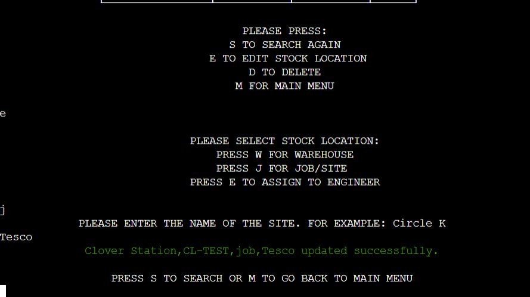

# Inventory Management
[Link to deployed project](https://pp3-inventory-management-app.herokuapp.com/)
---

Inventory Management is a software program developed to facilitate the management of serialized inventory for businesses. This application is specifically tailored for businesses that utilize stock with unique serial numbers. The implemented features allow the user to efficiently add, search, view, change location, and delete stock from the system. These capabilities prove particularly valuable to businesses that install equipment in various locations and rely on engineering services to do so, as the program enables them to keep track of the precise location of each item.

# Table Of Content

-   [User Experience](#user-experience)
    - [User Stories](#user-stories)
    - [Goals](#goals)
    - [Scope](#scope)
-   [Design](#design)
    - [Colour Scheme](#colour-scheme)
    - [Flowchart](#flowchart)
-   [Features](#features)
    - [Welcome Screen](#Welcome-Screen)
    - [Main Menu](#main-menu)
    - [C - Add stock](#c---add-stock)
    - [V - View Stock](#v---view-stock)
    - [S - Search and edit](#s---search-and-edit)
    - [E - Edit stock location](#e---edit-stock-location)
    - [D - Delete](#d---delete)
    - [I - Instructions](#i---instructions)
    - [Q - Quit](#q---quit)
-   [Future Features](#future-features)
-   [Testing](#testing)
-   [Bugs](#Bugs)
-   [Technologies And Languages](#technologies-and-languages)
    - [Languages Used](#languages-used)
    - [Python Modules](#python-modules)
    - [User Defined Modules](#user-defined-modules)
    - [Technologies and programs](#technologies-and-programs)
-   [Deployment](#deployment)
    - [Before Deployment](#before-deployment)
    - [Deployment on Heroku](#deployment-on-heroku)
    - [Creating A Fork](#creating-a-fork)
    - [Cloning Repository](#cloning-repository)
-   [Credits](#credits)
    - [Media](#media)
    - [Code](#code)
    - [Acknowledgements](#acknowledgements)
    - [Comments](#comments)

---

# User Experience

## User Stories

1. As a warehouse manager, I want to easily add new items to the inventory system, so that I can keep track of all the items that we have in stock.
2. As a warehouse manager, I want to be able to search for specific items in the inventory system, so that I can quickly locate items when I need them.
3. As an engineer, I want to be able to update the location of items in the inventory system, so that I can keep track of the location of items that I need to use in the field.
4. As a warehouse manager, I want to be able to view all stock in the inventory system, so that I can have a comprehensive overview of all items in stock.
5. As an inventory manager, I want to be able to delete items from the inventory system, so that I can remove items that are no longer in use or have been added incorrectly
6. As an inventory manager, I want to be able to ensure that duplicate items are not added to the inventory system, so that I can maintain an accurate and efficient inventory.

## Goals

1. Develop a feature to enable the user to easily add new items to the inventory system
2. Develop a search feature to enable the users to quickly and easily locate items in the inventory system
3. Develop a feature that enables users to easily change the location of items in the inventory system
4. Enable users to delete items from the inventory system in a simple and efficient manner, ensuring the inventory remains up-to-date and accurate.
5. Develop a feature that allows users to easily view all of the stock in the inventory system or refine by location, making it easy to keep track of inventory in different locations.
6. Develop a feature that prevents the addition of duplicate items to the inventory system
7. Delevop easy to navigate menu
8. Add instructions on how to use the application

## Scope

Required functionality:

1. Easy to navigate menu
2. Add stock feature which allows the user to input name of the item, serial number, location and location name
3. Search the inventory by serial number and only add stock if it does not exist already
4. Display all stock or by location feature
5. Search the inventory by serial number and display all the information for this item
6. Change stock location feature
7. Delete stock from the system
8. Display instructions on how to user to program

# Design

## Colour Scheme
The main text colour is the standart white colour. 
Red colour was used to highlight invalid input and warning messages.  
Green colour was used to highlight success messages 
## Flowchart
The flowchart for the program was created by [diagrams.net](https://www.diagrams.net/)

Flowchart Image

# Features
## Welcome Screen
The welcome screen is displayed when the program runs. It uses ASCII art to surround the welcome message.  

## Main Menu
The main menu is displayed when the program runs initially and when the user selects the main menu option from another menu. This menu allows the user to access the program's functionalities.  
 
## C - Add stock
This option allows the user to add stock to the inventory system. The following steps are required to add stock. The user must input name, serial number, stock location, and location name. Each input is validated and it will display a warning message to the user with guidelines for the input requirements. The user is presented with three possible locations for the serial number entered. 
1. Warehouse - This location has two options:
- Good - This is where all good stock is stored
- Bad - This is where faulty, broken stock or returns are stored
2. Job/Site - This is the location where the stock was installed
- The user must enter the name of the job.
3. Engineer - This location is selected when the stock is given to engineer's inventory
- Name of the engineer holding the stock must be entered.

  
The program will then check if this serial number already exist. If it doesn't exist will display all of the details entered in green with success message and will add the serial number. If the serial number already exist a message in red will appear to warn the user that this serial number is already on the system and will redirect back to the main menu.

## V - View Stock
This option allows the user to view the current inventory by location or all stock. The data is presented in a easy to read table. 
  
The user have the options to go back to view menu or back to main menu.

## S - Search and edit
This option allows the user to search the system by serial number. 
1. If the serial number doesn't exist on the system the user will be presented with a message in red advising that this serial number wasn't found. The user will be redirected to the main menu.
  
2. If the serial number exists on the system, the data will be displayed in a table. The user will be presented with a menu that will allow them to search again, edit, delete, or go back to the main menu.
  
- The search again option will bring the user back to the search screen and will ask for the serial number.
## E - Edit stock location 
The edit stock location will allow the user to change the location of the stock. It will require location input followed by location name. If the input is valid the user will be presented with a success message with the new details saved on the system. The user can either search again or go back to the main menu.
  
## D - Delete 
The delete option will ask the user for confirmation if they wish to delete the serial number from the system. Once the user presses Y the data is deleted permanently. 
  
- The main menu option brings the user back to the main menu.

## I - Instructions
This option will print to the user the instructions on how to use the application with typewritter effect. Then the main menu is displayed. 
  

## Q - Quit
The user will be asked for confirmation if they wish to quit.
- Y exits the program
- N brings the user back to the main menu.
  

# Future Features
- I would like to use a database to store all the data.
- I would like to implement a feature showing stock movements for each serial number. 
- I would like to build a front end for this application for easier navigation through the features

# Testing
Testing documentation can be found under [Testing.md](./testing.md)
# Bugs
1. During the testing stages of the application an infinite loop was discovered when invalid input was entered. The message invalid input kept printing. This was resolved by printing the menu within the while loop. 
2. Before a new serial number is added, the system will loop through each spreadsheet and search if the serial number exists and will update a variable with the result. I was getting incorrect results due to the fact that the variable was updated on every loop and if the serial number is not found in the last spreadsheet then the variable is updated as not found. This was resolved by adding a condition to update the variable only if the result is not none. Screenshot attatched showing the value of the variable changing on each loop. Further tests confirmed that the issue was resolved
  

# Storage Data
The application uses Google Sheet API or Gspread to store and manipulate the data. The spreadsheet consist of three worksheets - one for each location. Every time new entry is added a row with the information is added to the corresponding spreadsheet. When the user selects the option to change the location of an item, the program will update the changes and will check if the data is in the correct worksheet. If it is in the wrong worksheet the app will move it to the correct one and delete the original to avoid duplicates.  
  
# Technologies And Languages
## Languages Used
- Python
- CSS to add style to the body of layout.html

## Python Modules
- [Gspread](https://docs.gspread.org/en/latest/index.html) - to access Google Sheets and edit data
- [Google auth](https://google-auth.readthedocs.io/en/stable/index.html) - was used for authentication with google APIs using credentials.
- [Sys](https://docs.python.org/3/library/sys.html?highlight=sys#module-sys) - to call specific functions to allow to display the text with typewritter effect
- [Time](https://docs.python.org/3/library/time.html?highlight=time#module-time) - to add a sleep function between displaying each character
- [Re](https://docs.python.org/3/library/re.html?highlight=re#module-re) - to create a regex pattern for input validation
- [Rich](https://rich.readthedocs.io/en/stable/introduction.html) - to create tables and add colour to text
## User defined modules
- app_text - was used to store the welcome screen ASCII and the instructions on how to use the application.
## Technologies and programs
- [GitHub](https://github.com/) is the hosting site used to store the code for the website.
- [Git](https://git-scm.com/) was used as a version control software to commit and push the code to the GitHub repository.
- [Heroku](https://www.heroku.com) was used to deploy the application
- [CI Python Linter](https://pep8ci.herokuapp.com/) was used to validate the python code
- [Diagrams.net](https://www.diagrams.net/) was used to create the flowchart
- [CI Template](https://github.com/Code-Institute-Org/python-essentials-template) was used as a starting point for the project
# Deployment
## Before Deployment
To ensure the application is deployed correctly on Heroku it is mandatory to update the requirements.txt. This is a list of requirements that the application needs in order to run. 
- To create the list of requirements we use the command pip3 freeze > requirements.txt. This will ensure the file with the requirements is updated.
- Next, we need to commit and push the changes to GitHub.
## Deployment on Heroku
- To deploy the project on [Heroku](https://www.heroku.com), first we need to create an account.
- Once logged in, we need to create a new app by clicking on the create app button
- We need to pick a unique name for the app, select our region and click create app.
- On the next page we select the settings tab and scroll down to Config Vars. If there are any files that should be hidden like credentials and API keys they should be added here. In this project, we have credentials that we need to protect. To do this we have created a config var and added CREDS as the key and the content of the creds.json file as value.
- If we scroll down to Buildpacks we can add the buildpacks required for the project to be deployed correctly. The buildpacks will install further dependencies that are not included in the requirements.txt. For this project, there are two buildpacks required - Python and Nodejs.
- From the tab above we select the deploy section. 
- We need to select a deployment method and for this project it was GitHub. We then confirm that we want to connect to GitHub and search for the repository name and click connect to connect the Heroku app to our GitHub code. 
- If we scroll further down to the deploy section we can enable automatic deploys which means that the app will update every time we push code to GitHub. We click deploy and wait for the app to be built. Once this is done a message should appear letting us know that the app was successfully deployed with a view button to see the app.  
### This application was deployed [Here](https://pp3-inventory-management-app.herokuapp.com/)

## Creating a fork
1. Navigate to the [repository](https://github.com/Dayana-N/inventory-management-PP3)
2. In the top-right corner of the page we click on the fork button and select create a fork.
3. We can change the name of the fork and add a description 
4. We can choose to copy only the main branch or all branches to the new fork. 
5. If we lick Create a Fork, a repository should appear in our GitHub

## Cloning Repository
1. Navigate to the [repository](https://github.com/Dayana-N/inventory-management-PP3)
2. We click on the Code button on top of the repository and copy the link. 
3. We open Git Bash and change the working directory to the location where we want the cloned directory. 
4. We type git clone and then paste the link.
5. We press Enter to create our local clone.

# Credits
## Media
- Background image [Creative Fabrica](https://www.creativefabrica.com/product/inventory-control-illustration-concept-2/)
## Code
- Learned how to use typewritter effect within the terminal from [Stack Overflow](https://stackoverflow.com/questions/20302331/typing-effect-in-python)
- The ASCII art was inspired by this [project](https://github.com/PedroCristo/portfolio_project_3/blob/main/hangman_art.py) and then modified to the application's needs
- Learned how to use Regular Expressions [Here](https://docs.python.org/3/howto/regex.html) and [Here](https://regex101.com/)
- Learned how to use Google auth and gspread from the Love Sandwiches walkthrough project
## Acknowledgements
A huge Thank You to my mentor Ronan McClelland for all the brilliant advice and resources and the Slack Community for their feedback and support
## Comments
The idea for this project came from my previous job where we used a custom-build system to manage stock, job orders, engineer details, and various other tasks. This project was developed solely from my concept and without any assistance from tutorials or guidance. I am very happy with the end product, which is a completely operational application that can be used in a real-world setting. It was a great learning experience and I am looking forward to the next project. 
