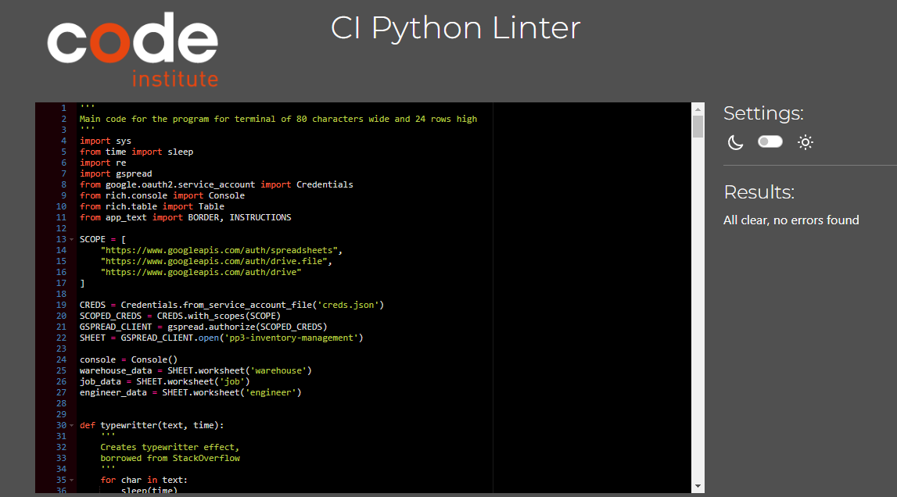
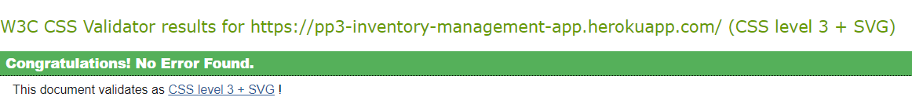
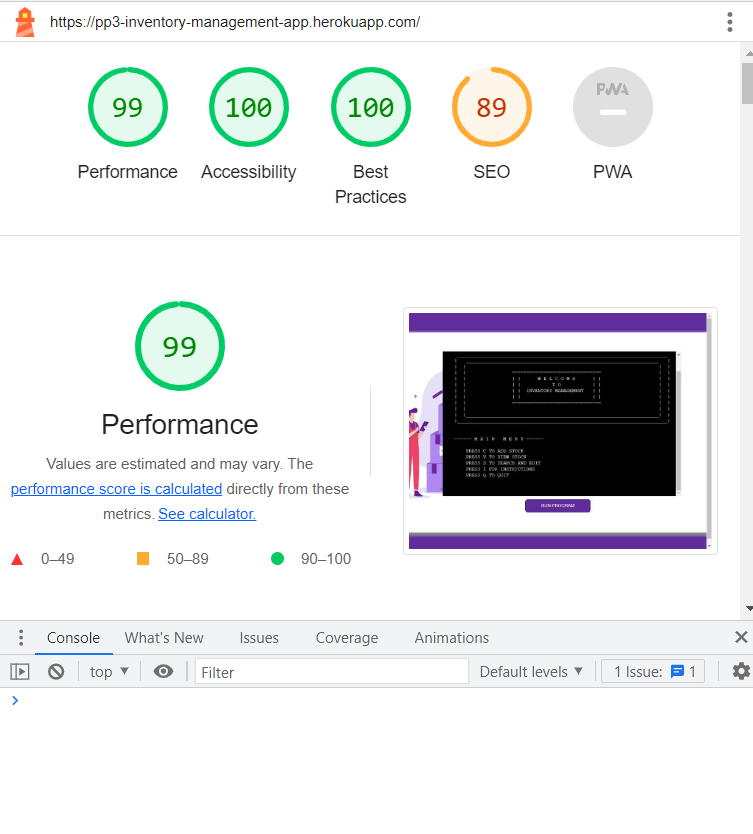
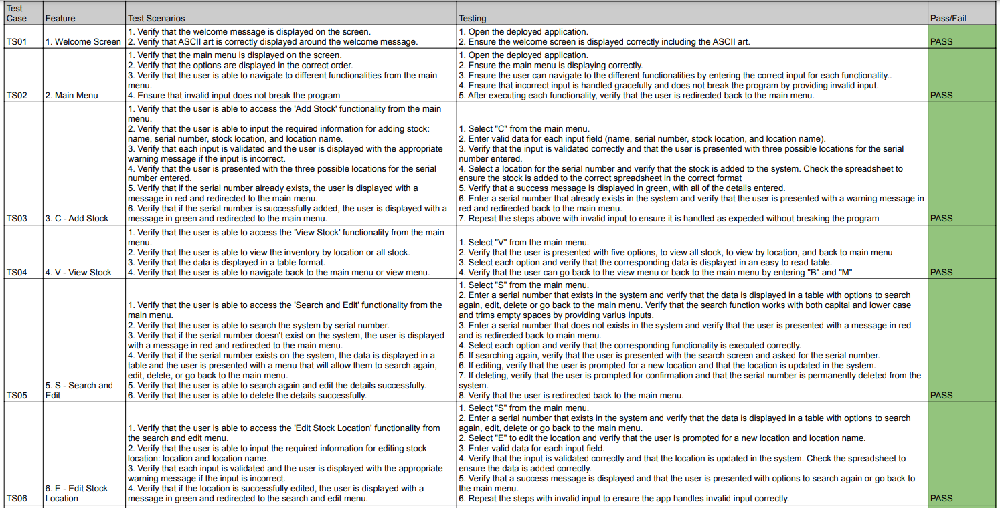

# Inventory Management Testing Documentation
## Link to deployed app [Here](https://pp3-inventory-management-app.herokuapp.com/)
---
## Contents
* [User Story Testing](#user-story-testing)
* [Automated Testing](#automated-testing)
  * [Pep8 CI Python Linter](#pep8-ci-python-linter)
  * [The W3C CSS Validation Service](#the-w3c-css-validation-service)
  * [Google Lighthouse](#google-lighthouse)
* [Manual Testing](#manual-testing)
  * [Features Testing](#features-testing)

# User Story Testing

### 1.  As a warehouse manager, I want to easily add new items to the inventory system, so that I can keep track of all the items that we have in stock.
---
The add stock feature can be accessed from the main menu. The user is then asked to input a stock name, serial number, location, and location name. The stock is then added to the system. 

### 2. As a warehouse manager, I want to be able to search for specific items in the inventory system, so that I can quickly locate items when I need them.
---
The search and edit feature can also be accessed from the main menu. The user can easily search the system by serial number. To improve the user experience empty spaces are removed from the beginning and the end of the input. This is helpful if the user uses copy/paste and there are some empty spaces. The result is displayed in a table format for easier readability. 

### 3. As an engineer, I want to be able to update the location of items in the inventory system, so that I can keep track of the location of items that I need to use in the field.
---
The stock's location can be easily updated from the search and edit feature. The user will have to search for the serial number they wish to move, then select edit location where they will be asked to enter the new location and location name. If the input is valid the application will display a success message with the new details. 

### 4. As a warehouse manager, I want to be able to view all stock in the inventory system, so that I can have a comprehensive overview of all items in stock.
---
The user can access the view stock feature from the main menu. They will have the option to view all stock, warehouse stock, engineer stock, or stock assigned to the job/location. Once the user selects an option the data is displayed in a table format for easier readability. 

### 5. As an inventory manager, I want to be able to delete items from the inventory system, so that I can remove items that are no longer in use or have been added incorrectly
---
The delete stock feature can be accessed from the search and edit option in the main menu. After searching by serial number the user can select the option delete. This option will ask the user for confirmation if they wish to delete the serial number from the system. Once the user presses Y the data is deleted permanently.

### 6. As an inventory manager, I want to be able to ensure that duplicate items are not added to the inventory system so that I can maintain an accurate and efficient inventory.
---
To ensure that no duplicates are stored, the application does the following:
- When the user adds a new stock, the program will search the system checking if the serial number exists.  If the serial number already exists, the user is immediately notified with a warning message. If the serial number is not found, it will be added to the system. 
- When the user changes the location of a serial number from the search and edit menu, the program ensures that the old data is replaced with the updated location. This guarantees that a single serial number is not registered in two different locations, eliminating any confusion.

# Automated Testing
## Pep8 CI Python Linter
Result - All clear, no errors found  
  
### Result - Pass

## The W3C CSS Validation Service
Small changes were made to the layout.html file to add a background image and center the terminal and the button. The additional CSS code passed the validator with no errors.  
  
### Result - Pass

## Google Lighthouse
  
### Result - Pass

# Manual Testing
## Features Testing
This section will cover the manual testing of the features of the application. The purpose of manual testing is to identify any potential bugs or issues in the application's functionalities. The following steps were repeated multiple times from early development. Print statements were used throughout the program to ensure things are working correctly as the application is built.  
The full testing document can be found [here](./assets/testing/PP3-testing.pdf). Please note that this is a pdf document and will require a program like Adobe Acrobat Reader DC to open it.   
  